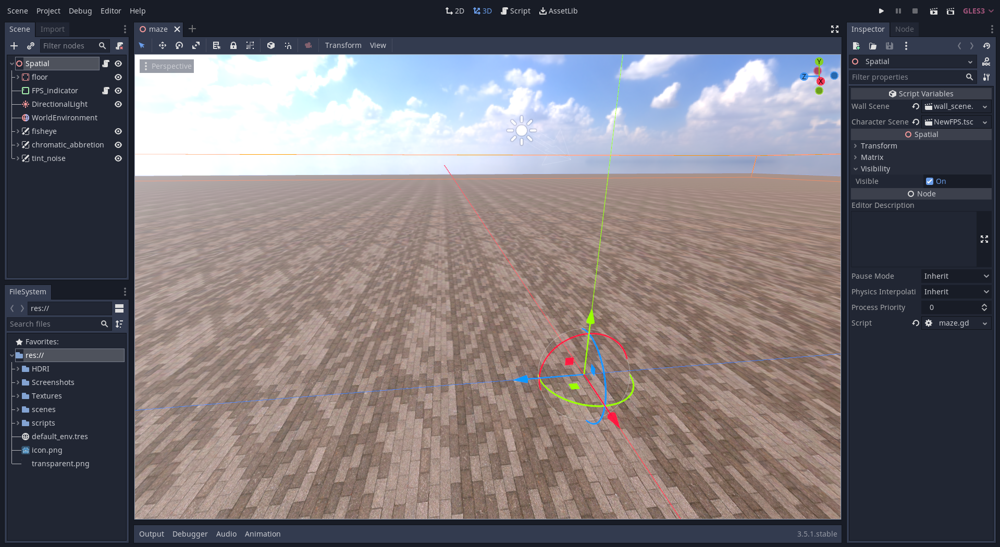
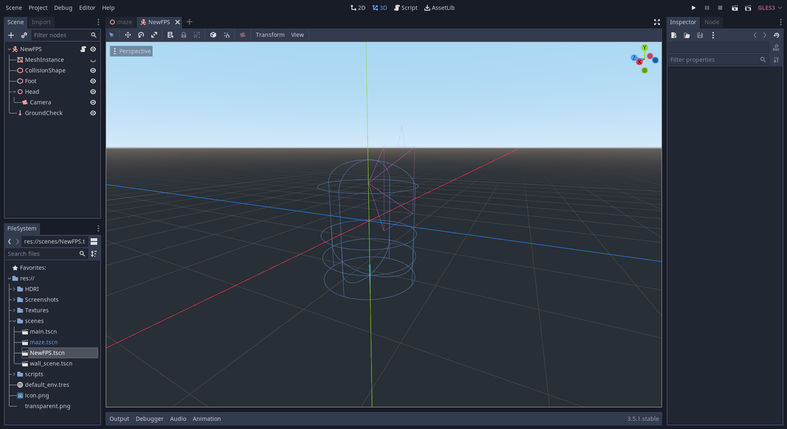

# Random_Maze_Generator
 ## A simple adjustable maze with FPS controller in GODOT 3

 This is a simple maze generator with **height**, **width** and **cell** size(spaciing between walls) options so that it can generate unique mazes.

 Also the algorithm is made in such a manner that every time the game **reloads**, you will get a **random** maze every time. Altough large scale maze generation is heavy since the code is **less optimized** for generating **large** mazes.

 ### Here is the maze generation code
 ```gdscript
    extends Spatial

    const CELL_SIZE = 2
    const MAZE_WIDTH = 25
    const MAZE_HEIGHT = 25
    export(PackedScene) var wall_scene
    export(PackedScene) var character_scene

    var maze = []
    var stack = []
    var visited = {}

    func _ready():
        randomize()
        generate_maze()
        create_maze_mesh()
        spawn_character()

    func generate_maze():
        maze = []
        for y in range(MAZE_HEIGHT):
            maze.append([])
            for x in range(MAZE_WIDTH):
                maze[y].append(1)
        
        var start_x = 1
        var start_y = 1
        stack.append(Vector2(start_x, start_y))
        visited[Vector2(start_x, start_y)] = true
        maze[start_y][start_x] = 0
        
        while stack.size() > 0:
            var current = stack[-1]
            var neighbors = get_unvisited_neighbors(current)
            
            if neighbors.size() > 0:
                var next = neighbors[randi() % neighbors.size()]
                remove_wall_between(current, next)
                stack.append(next)
                visited[next] = true
                maze[next.y][next.x] = 0
            else:
                stack.pop_back()

    func get_unvisited_neighbors(cell):
        var neighbors = []
        var directions = [Vector2(0, -2), Vector2(2, 0), Vector2(0, 2), Vector2(-2, 0)]
        for dir in directions:
            var neighbor = cell + dir
            if is_inside_maze(neighbor) and !visited.has(neighbor):
                neighbors.append(neighbor)
        return neighbors

    func remove_wall_between(a, b):
        var wall_pos = (a + b) / 2
        maze[wall_pos.y][wall_pos.x] = 0

    func is_inside_maze(cell):
        return cell.x > 0 and cell.x < MAZE_WIDTH - 1 and cell.y > 0 and cell.y < MAZE_HEIGHT - 1

    func create_maze_mesh():
        for y in range(MAZE_HEIGHT):
            for x in range(MAZE_WIDTH):
                if maze[y][x] == 1:
                    var wall = wall_scene.instance()
                    wall.transform.origin = Vector3(x * CELL_SIZE, 0, y * CELL_SIZE)
                    add_child(wall)

    func spawn_character():
        if character_scene:
            var character = character_scene.instance()
            var center_x = int(MAZE_WIDTH / 2) * CELL_SIZE
            var center_y = int(MAZE_HEIGHT / 2) * CELL_SIZE
            character.transform.origin = Vector3(center_x, 0, center_y)
            add_child(character)
```

Make sure you make your scene something like this



## FPS controller
 I have also added a basic FPS controller so that you can test the maze you generated.

 ### Here is the code for FPS controller

```gdscript

    extends KinematicBody

    var speed = 3 # or 5 for main scene
    var mouse_senstivity = 0.30
    var direction = Vector3()
    var h_acceleration = 6
    var h_velocity = Vector3()
    var movement = Vector3()
    var gravity_vec = Vector3()
    var gravity = 40
    var jump = 5
    onready var head = $Head

    func _ready():
        Input.set_mouse_mode(Input.MOUSE_MODE_CAPTURED)       #MOUSE_MODE_CAPTURED

    func _input(event):
        #if event is InputEventScreenDrag:
        if event is InputEventMouseMotion:
            rotate_y(deg2rad(-event.relative.x * mouse_senstivity))
            head.rotate_x(deg2rad(-event.relative.y * mouse_senstivity))
            head.rotation.x = clamp(head.rotation.x, deg2rad(-89), deg2rad(89))

    func _physics_process(delta):
        
        direction = Vector3()
        
        if not is_on_floor():
            gravity_vec += Vector3.DOWN * gravity * delta
        else:
            gravity_vec = -get_floor_normal() * gravity
        if Input.is_action_just_pressed("jump") and is_on_floor():
            gravity_vec = Vector3.UP * jump
        
        if Input.is_action_pressed("move_forward"):
            direction -= transform.basis.z

        elif Input.is_action_pressed("move_backward"):
            direction += transform.basis.z
            
        if Input.is_action_pressed("move_left"):
            direction -= transform.basis.x
            
        elif Input.is_action_pressed("move_right"):
            direction += transform.basis.x
            
        direction = direction.normalized()
        h_velocity = h_velocity.linear_interpolate(direction * speed, h_acceleration * delta)
        movement.z = h_velocity.z + gravity_vec.z
        movement.x = h_velocity.x + gravity_vec.x
        movement.y = gravity_vec.y
        
        move_and_slide(movement, Vector3.UP)
```
